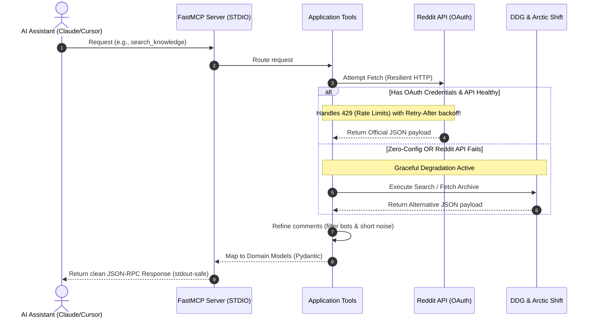

# 🤖 Reddit MCP Server (AI-Native Edition)

[](https://github.com/ismailsaoulaj/reddit-mcp-server/actions)
[](https://www.python.org/)
[](https://opensource.org/licenses/MIT)
[](#-prerequisites--setup)

A highly resilient, open-source [Model Context Protocol (MCP)](https://modelcontextprotocol.io/) server. It empowers AI models (such as Claude and Cursor) to search, fetch, read, and deep-dive into Reddit content with robust rate-limiting recovery and smart comment-filtering.

Built in Python using `FastMCP`, this project adheres to a strict **4-Layer Architecture** designed for high modularity, testability, and painless contributions.

---

## 🗺️ How it Works (Data Flow Sequence)

Here is a visual sequence diagram showing how the AI model interacts with this server, including our **Zero-Config Fallback** system:



---

## ✨ Features

- 🚀 **Zero-Config Ready:** Works completely out of the box! No Reddit API keys required. If credentials are not provided, it seamlessly falls back to DuckDuckGo and the Arctic Shift archive.
- 🛡️ **Graceful Degradation:** Intelligently switches between the official Reddit API and unauthenticated fallback providers without crashing, ensuring the LLM always gets data.
- 📈 **Resilient HTTP Client:** Built-in exponential backoff and rate-limiting recovery. If Reddit says `429 Too Many Requests`, the server respects the `Retry-After` header and retries automatically.
- 🔍 **Strategic Search:** Integrates a decoupled search provider system (Strategy Pattern) allowing easy addition of custom search engines.
- 🤖 **LLM-Safe Filtering:** Cleans thread payloads by dropping auto-moderators, bot notifications, and low-quality comments, saving precious LLM token costs.
- ⏱️ **Strict LLM Timeout Protection:** Uses decorators to force safe API timeouts, returning clean graceful JSON-RPC fallbacks instead of hanging the AI client.

---

## 🧰 Available Tools

| Tool Name | Purpose | Best Used For |
| :--- | :--- | :--- |
| `search_knowledge` | Broad web search via DuckDuckGo | Finding technical explanations and factual discussions across Reddit. |
| `explore_reddit_discussions` | Discussion search with metrics | Gauging sentiment, upvote consensus, and topic exploration. |
| `extract_public_opinion` | Deep comment tree extraction & filtering | Reading high-quality community opinions with noise & bots removed. |
| `analyze_niche_trends` | Live trending & rising posts tracker | Identifying real-time problems, pain points, or new ideas in a niche. |
| `get_saved_posts` | The user's own saved posts over a time period | Revisiting, summarizing, or triaging bookmarked content (requires the saved-items feed URL). |

---

## ⚙️ Prerequisites & Setup

### Requirements

- Python 3.11 or higher
- Reddit API App credentials (Optional, but recommended for live trending data & better rate limits)

### Quick Start

You can run this server directly without installation using `uvx` (recommended) or `pipx`:

```bash
uvx reddit-mcp-ai
# OR
pipx run reddit-mcp-ai
```

2. **Configure your environment (Optional):**

To unlock the official Reddit API and Saved Posts, you can either inject environment variables via your MCP client config, or create a global configuration file at `~/.config/reddit-mcp-server/.env` (Mac/Linux) or `%APPDATA%\reddit-mcp-server\.env` (Windows):

```env
REDDIT_CLIENT_ID="your_client_id_here"
REDDIT_CLIENT_SECRET="your_client_secret_here"
```

Consider also setting `REDDIT_USER_AGENT` to a descriptive, unique value — Reddit's API guidelines ask for this, even in zero-config mode. If unset, the server generates a default with a random per-install suffix (persisted under your [XDG state directory](https://specifications.freedesktop.org/basedir-spec/latest/) so it stays stable across restarts).

To enable the `get_saved_posts` tool, add your private saved-items feed URL:

```env
REDDIT_SAVED_RSS_URL="https://www.reddit.com/user/YOUR_USERNAME/saved.rss?feed=YOUR_FEED_TOKEN&user=YOUR_USERNAME"
```

While logged in, open **[reddit.com/prefs/feeds/](https://www.reddit.com/prefs/feeds/)** and copy the exact link for **"your saved links"**. The `feed` token is a credential for your account — treat it like a password (the server never logs it and rejects non-Reddit hosts). The feed exposes the most recent ~100 saved items; scores and comment counts are not available through it.

---

## 🐳 Docker Installation

A multi-stage Dockerfile is provided for seamless execution.

```bash
docker build -t reddit-mcp-server .
```

> **Note:** If using Docker, replace the `command` in client configs with `docker` and arguments with `run -i --rm reddit-mcp-server`.

---

## 🛠️ Configuration for AI Clients

### 1. Claude Desktop

Edit your configuration file:
- **macOS:** `~/Library/Application Support/Claude/claude_desktop_config.json`
- **Windows:** `%APPDATA%\Claude\claude_desktop_config.json`

**Simple / Zero-Config Setup (Recommended):**
```json
{
  "mcpServers": {
    "reddit": {
      "command": "uvx",
      "args": [
        "reddit-mcp-ai"
      ]
    }
  }
}
```

**Full Setup with Optional Features (OAuth & Saved Posts):**

```json
{
  "mcpServers": {
    "reddit": {
      "command": "uvx",
      "args": [
        "reddit-mcp-ai"
      ],
      "env": {
        "REDDIT_CLIENT_ID": "your_client_id_here",
        "REDDIT_CLIENT_SECRET": "your_client_secret_here",
        "REDDIT_SAVED_RSS_URL": "your_feed_url_here"
      }
    }
  }
}
```

### 2. Cursor / OpenCode

Go to **Settings > Features > MCP** and add a new command-based server:
- **Type:** command
- **Name:** Reddit
- **Command:** `uvx reddit-mcp-ai`
- **Env:** (Optional) Add `REDDIT_SAVED_RSS_URL` and your feed link here if you want to use the saved posts feature.

---

## 🧪 Developer Experience (DX) & Testing

We prioritize high test coverage. We mock all network traffic, ensuring tests run instantly and reliably.

### Run Tests

```bash
# Install development dependencies
pip install -e ".[dev]"

# Execute pytest
pytest tests/
```

### Manual Testing with the MCP Inspector

```bash
npx @modelcontextprotocol/inspector uvx reddit-mcp-ai
```

This will launch a web browser UI where you can invoke the `search_knowledge`, `explore_reddit_discussions`, `extract_public_opinion`, and `analyze_niche_trends` tools directly and inspect the JSON responses.

---

## 🤝 Contributing & Architecture

We love contributions! Please check out `docs/architecture.md` for architectural details and view `src/reddit_mcp/infrastructure/search/providers/README.md` to learn how to add a new search provider in seconds.

Please make sure your PR passes all linter checks (`ruff check .`) and unit tests (`pytest tests/`) before submitting.