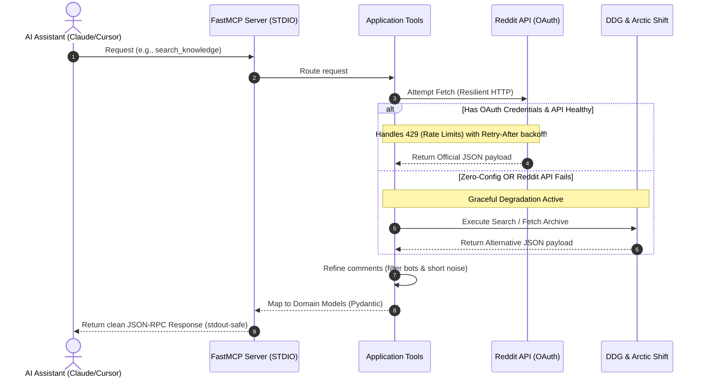

# Reddit MCP Server

> Give your AI assistant a live, structured window into Reddit — zero API keys required.

[](https://github.com/ismailsaoulaj/reddit-mcp-server/actions)
[](https://pypi.org/project/reddit-mcp-ai/)
[](https://www.python.org/)
[](https://opensource.org/licenses/MIT)
[](#️-prerequisites--setup)

**Reddit MCP Server** is an open-source [Model Context Protocol (MCP)](https://modelcontextprotocol.io/) server that connects AI assistants (Claude, Cursor, Open WebUI, and more) to Reddit's content in real time. It provides structured tools for searching discussions, extracting community opinions, and tracking niche trends — with a resilient multi-tier fallback engine that works even without any credentials.

```bash
# Get started in one command — no sign-up, no API keys
uvx reddit-mcp-ai
```

---

## 🗺️ How it Works (Data Flow Sequence)

Here is a visual sequence diagram showing how the AI model interacts with this server, including our **Zero-Config Fallback** system:



---

## ✨ Features

- 🚀 **Zero-Config Ready:** Works completely out of the box. No Reddit API keys required — it falls back automatically to DuckDuckGo and the Arctic Shift archive.
- 🛡️ **Cascading Multi-Tier Engine:** `Official OAuth` → `Session Cookie` → `Browser-Impersonated JSON` → `Arctic Shift RSS` → `DDG`. The AI always gets data, even when Reddit is rate-limiting or credentials are missing.
- 🚦 **Built-in Anti-Ban Shields:** Token bucket rate limiter, global concurrency semaphore, and singleflight request coalescing prevent WAF 403 blocks and IP bans under heavy AI traffic.
- � **Resilient HTTP Client:** Exponential backoff with `Retry-After` respect, a bounded 14-second aggregate deadline, and automatic OAuth token self-healing on mid-flight 401s.
- 🤖 **LLM-Safe Filtering:** Drops AutoModerator, bots, and low-signal comments before they reach the model — saving tokens and reducing noise.
- ⏱️ **Strict Timeout Protection:** Decorator-enforced timeouts return clean JSON-RPC fallbacks instead of hanging the AI client.
- 🌐 **STDIO & SSE Transport:** Runs as a local CLI tool for Claude/Cursor or as a Docker microservice on port `8000` for Open WebUI, LibreChat, and n8n.

---

## 🧰 Available Tools

| Tool Name | Purpose | Best Used For |
| :--- | :--- | :--- |
| `search_knowledge` | Broad web search via DuckDuckGo | Finding technical explanations and factual discussions across Reddit. |
| `explore_reddit_discussions` | Discussion search with metrics | Gauging sentiment, upvote consensus, and topic exploration. |
| `extract_public_opinion` | Deep comment tree extraction & filtering | Reading high-quality community opinions with noise & bots removed. |
| `analyze_niche_trends` | Live trending & rising posts tracker | Identifying real-time problems, pain points, or new ideas in a niche. |
| `get_saved_posts` | The user's own saved posts over a time period | Revisiting, summarizing, or triaging bookmarked content (requires the saved-items feed URL). |

---

## ⚙️ Prerequisites & Setup

### Requirements

- Python 3.11 or higher
- Reddit API App credentials (Optional, but recommended for live trending data & better rate limits)

### Quick Start

You can run this server directly without installation using `uvx` (recommended) or `pipx`:

```bash
# Run locally (STDIO mode) for Cursor/Claude
uvx reddit-mcp-ai

# OR run as a background service (SSE mode) for Web UIs
uvx reddit-mcp-ai --transport sse --host 0.0.0.0 --port 8000
```

**Configure your environment (Optional):**

To unlock the official Reddit API, Cookie Authentication, or Saved Posts, you can either inject environment variables via your MCP client config, or create a global configuration file at `~/.config/reddit-mcp-server/.env` (Mac/Linux) or `%APPDATA%\reddit-mcp-server\.env` (Windows):

```env
# Optional: Official Reddit App Credentials
REDDIT_CLIENT_ID="your_client_id_here"
REDDIT_CLIENT_SECRET="your_client_secret_here"

# Optional: Direct Cookie Auth (Instant sub-second access & pagination)
# Extract from DevTools -> Application -> Cookies -> reddit_session (Use an alt account)
REDDIT_SESSION_COOKIE="your_reddit_session_cookie_here"

# Optional: Concurrency & Rate Limiting Shields
REDDIT_MAX_CONCURRENCY=4
REDDIT_RATE_LIMIT_PER_MINUTE=40
```

Consider also setting `REDDIT_USER_AGENT` to a descriptive, unique value — Reddit's API guidelines ask for this, even in zero-config mode. If unset, the server generates a default with a random per-install suffix (persisted under your [XDG state directory](https://specifications.freedesktop.org/basedir-spec/latest/) so it stays stable across restarts).

To enable the `get_saved_posts` tool, add your private saved-items feed URL:

```env
REDDIT_SAVED_RSS_URL="https://www.reddit.com/user/YOUR_USERNAME/saved.rss?feed=YOUR_FEED_TOKEN&user=YOUR_USERNAME"
```

While logged in, open **[reddit.com/prefs/feeds/](https://www.reddit.com/prefs/feeds/)** and copy the exact link for **"your saved links"**. The `feed` token is a credential for your account — treat it like a password (the server never logs it and rejects non-Reddit hosts). The feed exposes the most recent ~100 saved items; scores and comment counts are not available through it.

---

## 🐳 Docker Installation

A multi-stage Dockerfile is provided. The container is configured to run in **SSE (HTTP) mode by default** on port `8000`, making it a perfect microservice.

```bash
# Build the image
docker build -t reddit-mcp-server .

# Run it in the background
docker run -d -p 8000:8000 --name reddit-mcp reddit-mcp-server
```

### Docker Compose Example

```yaml
services:
  reddit-mcp:
    build: .
    container_name: reddit-mcp
    ports:
      - "8000:8000"
    restart: unless-stopped
    environment:
      # Optional Configuration
      - REDDIT_CLIENT_ID=your_id_optional
      - REDDIT_CLIENT_SECRET=your_secret_optional
```

> **Note:** If using Docker with STDIO mode, replace the command in client configs with `docker` and arguments with `run -i --rm reddit-mcp-server`.

---

## 🛠️ Configuration for AI Clients

### 1. Claude Desktop

Edit your configuration file:
- **macOS:** `~/Library/Application Support/Claude/claude_desktop_config.json`
- **Windows:** `%APPDATA%\Claude\claude_desktop_config.json`

**Simple / Zero-Config Setup (Recommended):**
```json
{
  "mcpServers": {
    "reddit": {
      "command": "uvx",
      "args": [
        "reddit-mcp-ai"
      ]
    }
  }
}
```

**Full Setup with Optional Features (OAuth & Saved Posts):**

```json
{
  "mcpServers": {
    "reddit": {
      "command": "uvx",
      "args": [
        "reddit-mcp-ai"
      ],
      "env": {
        "REDDIT_CLIENT_ID": "your_client_id_here",
        "REDDIT_CLIENT_SECRET": "your_client_secret_here",
        "REDDIT_SAVED_RSS_URL": "your_feed_url_here"
      }
    }
  }
}
```

### 2. Cursor / OpenCode

Go to **Settings > Features > MCP** and add a new command-based server:
- **Type:** command
- **Name:** Reddit
- **Command:** `uvx reddit-mcp-ai`
- **Env:** (Optional) Add `REDDIT_SAVED_RSS_URL` and your feed link here if you want to use the saved posts feature.

### 3. Open WebUI (and other Web Clients)

When running the server via Docker or in SSE mode:
1. Go to **Admin Panel > Settings > External Connections / Tools**.
2. Add a new MCP Server.
3. **Type:** `SSE`
4. **URL:** `http://localhost:8000/sse` *(Use `http://host.docker.internal:8000/sse` if Open WebUI is also running in Docker).*

---

## 🧪 Developer Experience (DX) & Testing

We prioritize high test coverage. We mock all network traffic, ensuring tests run instantly and reliably.

### Run Tests

```bash
# Install development dependencies (using uv — recommended)
uv sync --locked --extra dev

# Or with pip
pip install -e ".[dev]"

# Execute pytest
uv run pytest tests/
```

### Manual Testing with the MCP Inspector

```bash
npx @modelcontextprotocol/inspector uvx reddit-mcp-ai
```

This will launch a web browser UI where you can invoke the `search_knowledge`, `explore_reddit_discussions`, `extract_public_opinion`, and `analyze_niche_trends` tools directly and inspect the JSON responses.

---

## 🤝 Contributing

Contributions are welcome! Here's how to get started:

1. Fork the repository and clone your fork.
2. Install dependencies: `uv sync --locked --extra dev`
3. Create a branch: `git checkout -b feature/your-feature-name`
4. Make your changes, then lint and test:
```bash
   uv run ruff check .
   uv run ruff format .
   uv run pytest tests/
```
5. Open a pull request — CI will run automatically.

For architectural guidance, see [`docs/architecture.md`](docs/architecture.md).
To add a custom search provider, see [`src/reddit_mcp/infrastructure/search/providers/README.md`](src/reddit_mcp/infrastructure/search/providers/README.md).

Please read [`CONTRIBUTING.md`](CONTRIBUTING.md) and [`CODE_OF_CONDUCT.md`](CODE_OF_CONDUCT.md) before submitting.